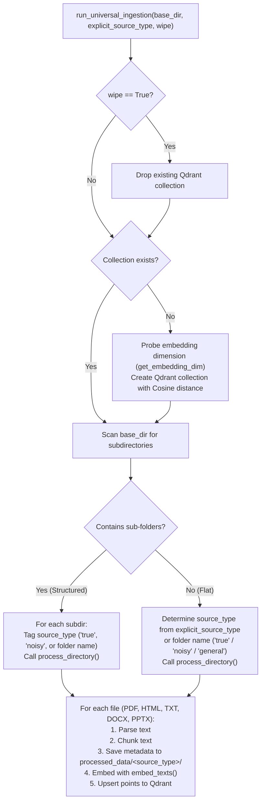

```mermaid
flowchart TD
    Start["run_universal_ingestion(base_dir, explicit_source_type, wipe)"] --> Step1{"wipe == True?"}
    Step1 -- Yes --> DropCol["Drop existing Qdrant collection"]
    Step1 -- No --> CheckCol
    DropCol --> CheckCol{"Collection exists?"}
    CheckCol -- No --> CreateCol["Probe embedding dimension (get_embedding_dim)<br/>Create Qdrant collection with Cosine distance"]
    CheckCol -- Yes --> ScanDir["Scan base_dir for subdirectories"]
    CreateCol --> ScanDir

    ScanDir --> HasSub{"Contains sub-folders?"}
    HasSub -- "Yes (Structured)" --> LoopSub["For each subdir:<br/>Tag source_type ('true', 'noisy', or folder name)<br/>Call process_directory()"]
    HasSub -- "No (Flat)" --> TagFlat["Determine source_type from explicit_source_type<br/>or folder name ('true' / 'noisy' / 'general')<br/>Call process_directory()"]

    LoopSub --> ProcessFile["For each file (PDF, HTML, TXT, DOCX, PPTX):<br/>1. Parse text<br/>2. Chunk text<br/>3. Save metadata to processed_data/&lt;source_type&gt;/<br/>4. Embed with embed_texts()<br/>5. Upsert points to Qdrant"]
    TagFlat --> ProcessFile
```
